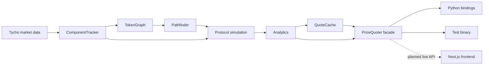
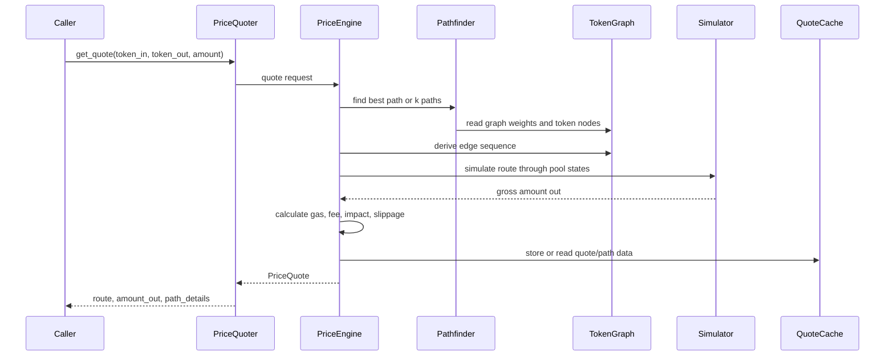
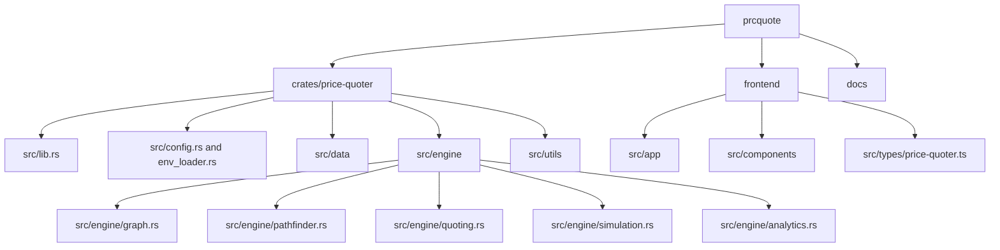
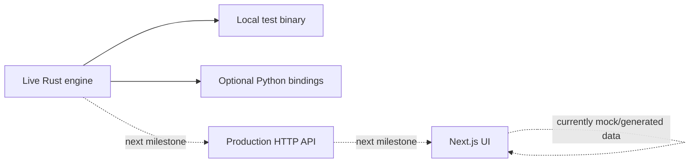

# Price Quoter

Real-time DEX price quotation system built around a Rust quote engine and a Next.js visualization frontend.

The backend ingests Tycho protocol state, maintains token and pool data, builds a graph of available liquidity, discovers swap routes, simulates executable paths, calculates quote metrics, and exposes the result through a reusable Rust library facade. The frontend shows the intended product workflows for prices, route exploration, token networks, watchlists, alerts, and settings.

For the full implementation reference, see [docs/price-quoter-system-reference.md](docs/price-quoter-system-reference.md).

## Architecture



## Quote Flow



## Repository Layout



## Main Components

| Component | Responsibility |
| --- | --- |
| `PriceQuoter` | Public Rust facade for lifecycle, quotes, token prices, stats, graph access, and arbitrage helpers. |
| `PriceEngine` | Coordinates pathfinding, simulation, gas-aware quote construction, token price calculation, and route aggregation. |
| `ComponentTracker` | Tracks Tycho pools, pool simulator states, tokens, metadata, and stream progress. |
| `TokenGraph` | Represents tokens as nodes and pools as directed edges. |
| `Pathfinder` | Finds best paths, k-shortest paths, non-overlapping paths, and pruned route candidates. |
| `QuoteCache` | Caches quotes, path results, and continuous token prices with TTL and invalidation support. |
| Next.js frontend | Presents price list, path explorer, token network, watchlist, alerts, and settings workflows. |

## Backend Setup

The Rust workspace is rooted at this directory.

```bash
cargo check -p price-quoter
cargo test -p price-quoter
```

Run the local Tycho smoke test:

```bash
cargo run -p price-quoter --bin test_price_quoter
```

Required runtime inputs for live data:

| Variable | Purpose |
| --- | --- |
| `TYCHO_URL` | Tycho endpoint. |
| `TYCHO_API_KEY` | Tycho API key. |
| `CHAIN` | Chain name, defaults to `ethereum` in config loading. |
| `TVL_THRESHOLD` | Minimum TVL filter for protocol components. |
| `RPC_URL` | Optional RPC endpoint. |
| `NUMERAIRE_TOKEN` | Optional pricing base token override. |
| `PROBE_DEPTH` | Optional probe amount for price calculations. |

Environment files are ignored by Git. Do not commit real credentials.

## Frontend Setup

The frontend is under `frontend`.

```bash
cd frontend
npm install
npm run dev
```

Build check:

```bash
cd frontend
npm run build
```

## Current Status



Implemented:

- Rust library facade and quote engine.
- Tycho ingestion and in-memory component tracking.
- Token/pool graph construction.
- Pathfinding, route simulation, analytics, and cache layers.
- Next.js UI structure and typed frontend models.
- Markdown system documentation with Mermaid diagrams.

Still planned:

- Production HTTP API around the Rust engine.
- Live frontend-to-backend quote integration.
- Deterministic integration tests around controlled pool state.
- Persisted price history, watchlists, and alerts.
- Cleaner production logging and complete runtime metrics.

## Documentation

| Document | Purpose |
| --- | --- |
| [docs/price-quoter-system-reference.md](docs/price-quoter-system-reference.md) | Full system reference with architecture, config, runtime flow, caveats, and milestones. |
| `docs/price-quoter-system-reference.html` | Generated printable reference, ignored by Git. |
| `docs/price-quoter-system-reference.pdf` | Generated PDF reference, ignored by Git. |

