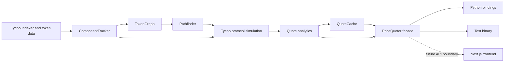
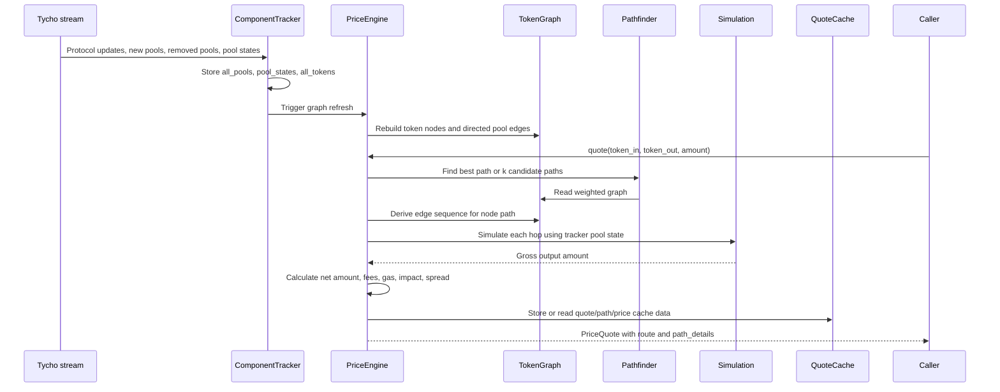
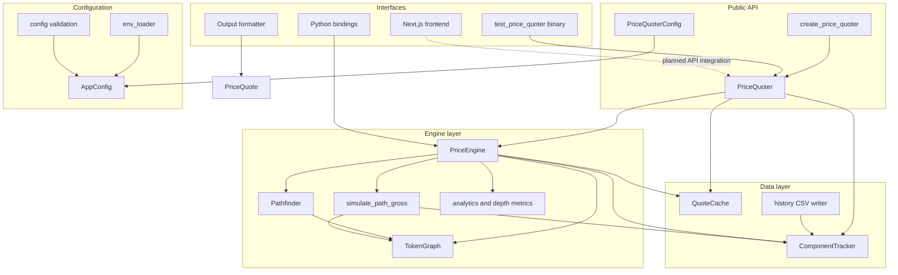
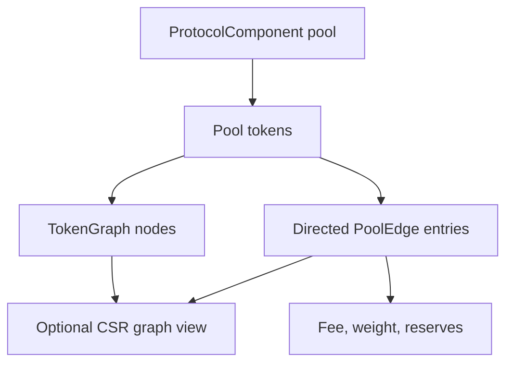
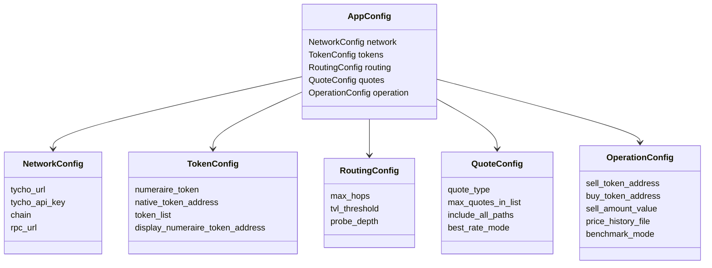
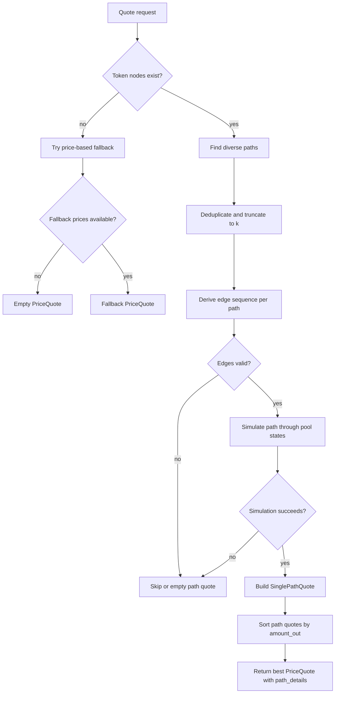
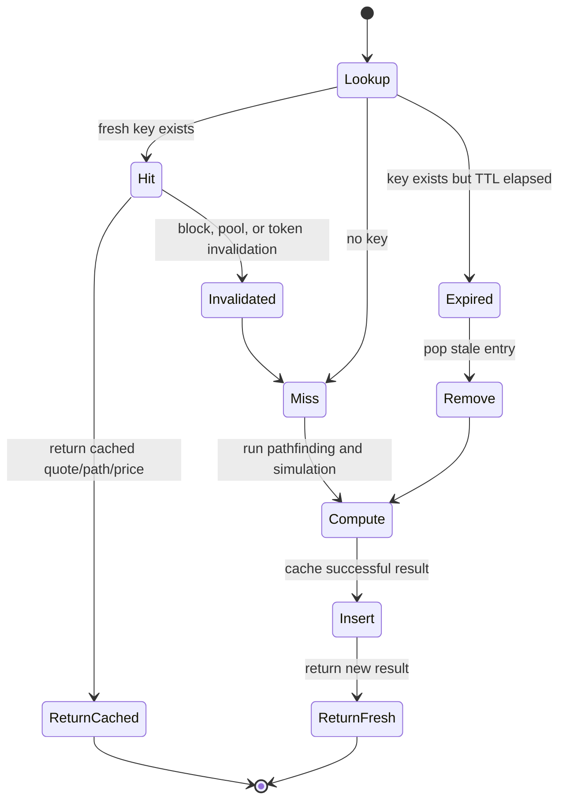
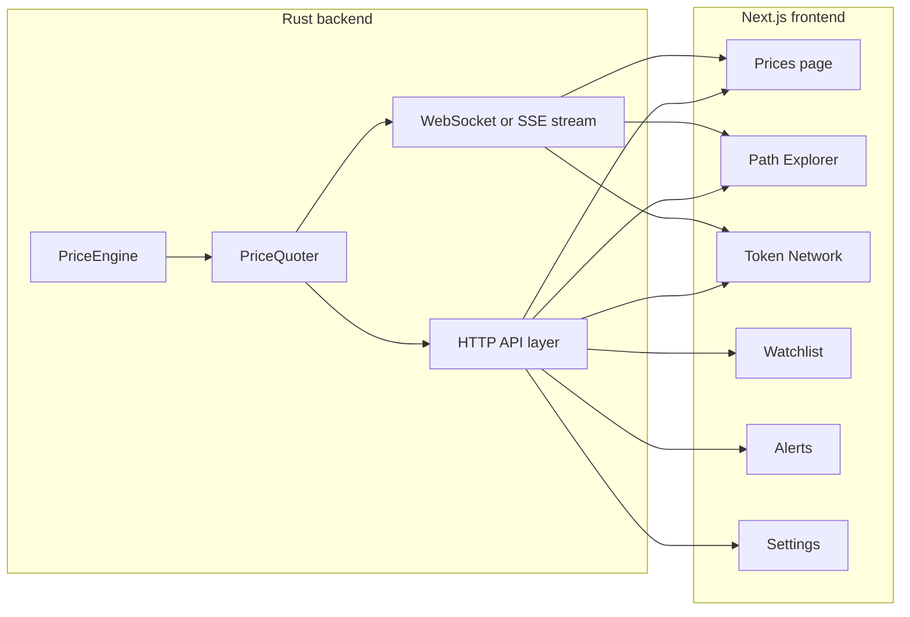
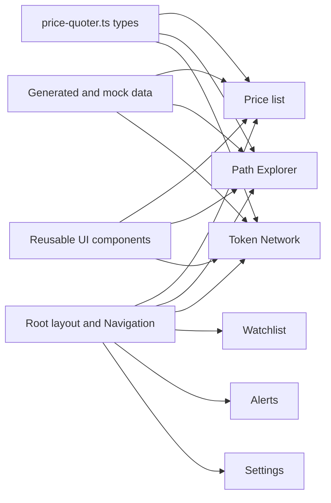

# Price Quoter System Reference

Last updated: 2026-04-26

This document explains the `prcquote` repository as a complete system. It covers the Rust quote engine, Tycho market-data ingestion, graph and pathfinding model, quote simulation pipeline, cache and analytics layers, optional Python and CLI surfaces, and the Next.js frontend.

The project is best understood as a Rust-first real-time DEX price quotation engine with a product-oriented frontend shell. The backend owns market state and quote computation. The frontend presents price lists, paths, token network views, watchlists, alerts, and settings.

## Table of Contents

- [System Purpose](#system-purpose)
- [Mermaid Diagram Index](#mermaid-diagram-index)
- [High-Level Architecture](#high-level-architecture)
- [Repository Map](#repository-map)
- [Runtime Data Flow](#runtime-data-flow)
- [Backend Modules](#backend-modules)
- [Configuration Model](#configuration-model)
- [Quote Lifecycle](#quote-lifecycle)
- [Data Structures](#data-structures)
- [Caching and Invalidation](#caching-and-invalidation)
- [Frontend Application](#frontend-application)
- [Interfaces and Feature Flags](#interfaces-and-feature-flags)
- [Operational Notes](#operational-notes)
- [Current Caveats](#current-caveats)
- [Recommended Next Milestones](#recommended-next-milestones)

## System Purpose

The system answers a practical DeFi execution question:

> Given an input token, output token, and amount, what route can execute the swap and what output should be expected?

DEX prices cannot be treated as static values. A useful quote depends on current pool state, token connectivity, route availability, fees, liquidity, gas assumptions, and path simulation. This repository models liquidity as a changing graph and computes quotes through current protocol state rather than a fixed price table.

| Goal | Design response | Main files |
| --- | --- | --- |
| Fresh market state | Ingest Tycho protocol stream updates into in-memory pool, state, and token maps. | `crates/price-quoter/src/data/component_tracker.rs` |
| Route discovery | Represent tokens as graph nodes and pools as directed graph edges. | `crates/price-quoter/src/engine/graph.rs` |
| Execution-aware quotes | Simulate path output through `tycho-simulation` pool state. | `crates/price-quoter/src/engine/simulation.rs` |
| Reusable backend | Expose a high-level `PriceQuoter` facade and reusable `PriceEngine`. | `crates/price-quoter/src/lib.rs`, `crates/price-quoter/src/engine/mod.rs` |
| Product surface | Provide a Next.js interface for exploring price and route workflows. | `frontend/src/app`, `frontend/src/components` |

## Mermaid Diagram Index

This reference includes Mermaid diagrams for the main system views:

| Diagram | Section | What it explains |
| --- | --- | --- |
| High-level architecture | [High-Level Architecture](#high-level-architecture) | External data, Rust engine components, cache, public facade, and UI surfaces. |
| Runtime sequence | [Runtime Data Flow](#runtime-data-flow) | How Tycho updates and quote requests move through the system. |
| Backend module dependencies | [Backend Modules](#backend-modules) | How `PriceQuoter`, `PriceEngine`, data modules, and interface modules depend on each other. |
| Token graph construction | [Token Graph](#token-graph) | How protocol pools become token nodes and pool edges. |
| Configuration model | [Configuration Model](#configuration-model) | `AppConfig` and its nested configuration structs. |
| Quote lifecycle | [Quote Lifecycle](#quote-lifecycle) | The decision flow from quote request to `PriceQuote`. |
| Cache lifecycle | [Caching and Invalidation](#caching-and-invalidation) | Cache hits, misses, insertions, expiry, and invalidation triggers. |
| Frontend data flow | [Frontend Data Flow](#frontend-data-flow) | How pages, components, types, and mock/generated data relate. |
| Planned live UI integration | [Frontend Application](#frontend-application) | The target path from Rust engine to HTTP/SSE/WebSocket API to Next.js screens. |

## High-Level Architecture



The important boundary is between computation and presentation. The Rust crate owns live state, graph construction, route search, simulation, quote shaping, and cache behavior. The frontend currently demonstrates the product model and UI workflows with generated/demo data and typed frontend models.

## Repository Map

| Area | Responsibility | Representative paths |
| --- | --- | --- |
| Workspace | Rust workspace definition. | `Cargo.toml` |
| Core crate | Real-time DEX quote engine. | `crates/price-quoter` |
| Public facade | User-facing Rust API and lifecycle helpers. | `crates/price-quoter/src/lib.rs` |
| Config | Typed runtime configuration, environment loading, validation. | `crates/price-quoter/src/config.rs`, `crates/price-quoter/src/env_loader.rs` |
| Data layer | Tycho ingestion, token universe metadata, quote cache, price history. | `crates/price-quoter/src/data` |
| Engine layer | Graph, pathfinding, simulation, analytics, quote aggregation. | `crates/price-quoter/src/engine` |
| Utilities | Gas calculator and token-list parsing. | `crates/price-quoter/src/utils` |
| Bindings | Optional Python extension surface. | `crates/price-quoter/src/bindings.rs` |
| Local binary | End-to-end Tycho connection and price update test. | `crates/price-quoter/src/bin/test_price_quoter.rs` |
| Frontend | Next.js application and reusable UI components. | `frontend/src` |
| Existing reference | Printable HTML/PDF technical reference. | `docs/price-quoter-system-reference.html`, `docs/price-quoter-system-reference.pdf` |

## Runtime Data Flow



The core runtime loop has two modes:

| Mode | Description | Entry points |
| --- | --- | --- |
| Stream ingestion | Connects to Tycho, loads tokens, subscribes to protocol updates, updates tracker state, then refreshes graph state. | `PriceQuoter::start`, `ComponentTracker::stream_updates` |
| On-demand quoting | Receives a quote request, discovers paths in the graph, simulates viable paths, calculates quote fields, and returns `PriceQuote`. | `PriceQuoter::get_quote`, `PriceQuoter::get_multi_quote`, `PriceEngine::quote_multi` |

## Backend Modules



### Public Facade

`PriceQuoter` is the main library interface for consumers. It owns shared runtime components:

| Field | Type | Purpose |
| --- | --- | --- |
| `engine` | `Arc<PriceEngine>` | Main quote, price, graph, and arbitrage logic. |
| `tracker` | `Arc<ComponentTracker>` | Live protocol components, pool states, and tokens. |
| `cache` | `Arc<RwLock<QuoteCache>>` | Shared quote/path/continuous price cache. |
| `config` | `PriceQuoterConfig` | Simplified user-facing configuration. |
| `all_token_prices` | `Arc<TokioRwLock<HashMap<Bytes, TokenPriceInfo>>>` | In-memory price table for tracked tokens. |
| `is_running` | `Arc<TokioRwLock<bool>>` | Runtime lifecycle flag. |

Important public methods:

| Method | Purpose |
| --- | --- |
| `PriceQuoter::new` | Builds tracker, graph, cache, and engine from `PriceQuoterConfig`. |
| `start` | Starts Tycho ingestion and continuous price update flow. |
| `stop` | Flips the runtime flag to stop background work. |
| `get_quote` | Returns a single best quote for a token pair and amount. |
| `get_multi_quote` | Returns a quote with multiple path details. |
| `get_best_quote` | Uses optimal-rate quote path with a configurable hint amount. |
| `get_token_price` | Calculates or retrieves token price in the configured numeraire. |
| `get_all_prices` | Returns the in-memory token price map. |
| `get_stats` | Returns tracked token counts and cache hit-rate information. |
| `find_arbitrage_cycles` | Finds cycles from start tokens for arbitrage exploration. |
| `optimize_cycle_trade` | Estimates an optimal amount and expected profit for a cycle. |

### Price Engine

`PriceEngine` coordinates the actual quote computation. It owns:

| Component | Purpose |
| --- | --- |
| `ComponentTracker` | Source of protocol pool state and token data used for simulation. |
| `TokenGraph` | Directed token/pool graph used for pathfinding. |
| `Pathfinder` | Best path, k-shortest path, non-overlapping path, BFS, A-star, and optional delta-SSSP logic. |
| `QuoteCache` | LRU cache for quotes, paths, and continuous token prices. |
| Gas fields | Gas price, average gas units per swap, native token address. |
| Numeraire fields | Base token and probe depth used for price calculations. |

Core engine functions:

| Function | Role |
| --- | --- |
| `quote` | Finds the best path and simulates one path. |
| `quote_multi` | Finds diverse candidate paths, simulates each, sorts by output, and returns best quote plus path details. |
| `quote_single_path_sync` | Runs real path simulation and builds a `SinglePathQuote`. |
| `get_token_price` | Calculates token price through forward/backward paths against numeraire. |
| `quote_at_optimal_rate` | Quotes using the configured probe depth or supplied hint amount. |
| `quote_multi_enhanced` | Extended multi-path allocation and optimization path. |
| `find_cycles` | Cycle search for arbitrage workflows. |
| `get_spot_price` | Marginal direct-path price helper. |
| `get_pool_reserves` | Reserve lookup by pool id. |

### Component Tracker

`ComponentTracker` is the in-memory market state owner.

| Stored state | Description |
| --- | --- |
| `all_pools` | Protocol components keyed by pool id. |
| `pool_states` | Tycho protocol simulator states keyed by pool id. |
| `all_tokens` | Token metadata loaded from Tycho. |
| `token_metadata` | Additional token-universe metadata used for filtering. |
| `universe_stats` | Aggregate token universe statistics. |
| `initialized` | Whether the tracker has received initial stream data. |
| `event_sender` | Optional event channel for stream updates. |

Stream responsibilities:

1. Load all tokens from Tycho.
2. Build a `ProtocolStreamBuilder` with chain-specific protocol subscriptions.
3. Apply TVL filtering through `ComponentFilter::with_tvl_range`.
4. Consume updates in a background task.
5. Add new pools, remove old pools, and update pool simulator states.
6. Emit `TrackerEvent` values and notify callbacks.

### Token Graph

`TokenGraph` maps the DEX universe into a directed graph.

| Graph object | Meaning |
| --- | --- |
| `TokenNode` | Token address, symbol, and decimals. |
| `PoolEdge` | Pool id, protocol, fee, optional route weight, and optional reserves. |
| `StableDiGraph<TokenNode, PoolEdge>` | Directed graph where each pool can create edges for token directions. |
| `token_indices` | Address-to-node-index lookup. |
| `pool_ids` | Set of pools currently represented in the graph. |



The graph creates directed edges for token pairs inside each pool. For path simulation, a node path is converted into an edge sequence with `derive_edges_for_node_path`.

### Pathfinder

`Pathfinder` searches `TokenGraph` for executable route candidates.

| Capability | Implementation area |
| --- | --- |
| Weighted best path | Dijkstra fallback in `best_path`. |
| K-shortest paths | Yen-style path discovery and wrappers. |
| Pruned enumeration | Liquidity, fee, gas, and efficiency filters. |
| Non-overlapping paths | Diverse route enumeration. |
| Alternative search | BFS, A-star, bidirectional shortest path helpers. |
| Parallel SSSP | Parallel/delta-stepping helpers and optional `delta_sssp` feature. |

Path pruning uses `PathPruningConfig`:

| Field | Meaning |
| --- | --- |
| `max_hops` | Maximum route depth. |
| `min_liquidity_per_hop` | Liquidity floor for exploring an edge. |
| `max_total_fee_bps` | Total fee limit across the route. |
| `min_efficiency_score` | Composite route quality floor. |
| `tvl_weight`, `gas_weight`, `fee_weight` | Scoring weights. |
| `liquidity_threshold_percentile` | Market-relative liquidity filter. |

### Simulation

Path simulation lives in `engine/simulation.rs`.

For each path edge:

1. Read the `PoolEdge` from the graph.
2. Read the matching simulator state from `ComponentTracker.pool_states`.
3. Read token models from `ComponentTracker.all_tokens`.
4. Call `ProtocolSim::get_amount_out`.
5. Carry the output amount into the next hop.

If any hop is invalid, missing, or fails simulation, the path returns `None` and quote generation produces an empty per-path quote for that route.

### Analytics

`engine/analytics.rs` contains:

| Functionality | Examples |
| --- | --- |
| Price impact | `calculate_price_impact_bps` |
| Slippage | `calculate_slippage_bps`, `find_depth_for_slippage_enhanced` |
| Spread | `calculate_spread_bps`, `calculate_spread_bps_from_two_way_prices` |
| Depth metrics | `calculate_multiple_depth_metrics` |
| Trade-depth optimization | `find_optimal_trade_depth_enhanced` and related curve analysis helpers |

Analytics keeps the quote easier to inspect by separating raw simulated output, net output, mid price, slippage, spread, depth, and gas-related adjustments.

## Configuration Model

There are two configuration layers:

| Layer | Purpose | Type |
| --- | --- | --- |
| Public library config | Minimal ergonomic config for consumers. | `PriceQuoterConfig` |
| Internal runtime config | Structured config used by engine, CLI, and bindings. | `AppConfig` |

### PriceQuoterConfig

| Field | Default or behavior |
| --- | --- |
| `tycho_url` | Required by constructor. |
| `tycho_api_key` | Required by constructor. |
| `chain` | Required by constructor, parsed through Tycho `Chain`. |
| `numeraire_token` | Ethereum WETH by default on Ethereum; Base WETH by default on Base. |
| `probe_depth` | `1_000_000_000_000_000_000` by default. |
| `max_hops` | `3` by default. |
| `tvl_threshold` | `100.0` by default. |
| `gas_price_gwei` | Optional; dynamic/default gas behavior is used elsewhere. |
| `infura_api_key` | Optional. |
| `rpc_url` | Optional. |
| `update_interval_ms` | `5000`. |
| `price_staleness_threshold_ms` | `30000`. |

Builder methods include `with_numeraire`, `with_probe_depth`, `with_max_hops`, `with_tvl_threshold`, `with_infura_key`, `with_rpc_url`, and `with_update_interval`.

### AppConfig



### Environment Variables

| Variable | Used by | Purpose |
| --- | --- | --- |
| `CHAIN` | `AppConfig::load`, `EnvConfig` | Chain name, defaults to `ethereum`. |
| `TYCHO_URL` | `AppConfig::load`, `EnvConfig` | Tycho endpoint. Defaults are chain-aware for Ethereum, Base, and Unichain. |
| `TYCHO_API_KEY` | `AppConfig::load`, `EnvConfig` | Tycho API key. |
| `RPC_URL` | `AppConfig::load`, `EnvConfig` | Optional RPC endpoint. |
| `NUMERAIRE_TOKEN` | `AppConfig::load` | Token used as pricing base. |
| `NATIVE_TOKEN_ADDRESS` | `AppConfig::load` | Native/wrapped native token address. |
| `TOKEN_LIST` | `AppConfig::load` | Comma-separated token list. |
| `DISPLAY_NUMERAIRE_TOKEN` | `AppConfig::load` | Display-only numeraire address/string. |
| `MAX_HOPS` | `AppConfig::load` | Routing hop limit. |
| `TVL_THRESHOLD` | `AppConfig::load`, `EnvConfig` | Pool/token filtering threshold. |
| `PROBE_DEPTH` | `AppConfig::load` | Probe amount for price calculations. |
| `PRICE_HISTORY_FILE` | `AppConfig::load` | Optional CSV output for historical token prices. |
| `INFURA_API_KEY` | `EnvConfig`, gas utilities | Optional gas/RPC support. |

`env_loader` also includes a small dotenv parser and redaction helpers. Sensitive keys and RPC URLs are redacted when printed.

## Quote Lifecycle



### Quote Construction

`quote_multi` does the following:

1. Optionally updates gas price when CLI feature behavior is active.
2. Verifies both tokens are in the graph.
3. Falls back to price-ratio quoting if graph nodes are unavailable but token prices exist.
4. Finds route candidates using k-shortest paths, non-overlapping paths, and BFS alternatives.
5. Deduplicates paths and limits to `k`.
6. Derives graph edge sequences.
7. Simulates each valid route with `quote_single_path_sync`.
8. Sorts successful path quotes by output.
9. Returns a `PriceQuote` where the best path is top-level and all sorted paths are in `path_details`.

### Single Path Quote Construction

`quote_single_path_sync` does the following:

1. Calls `simulate_path_gross`.
2. Converts node indices into route token addresses.
3. Extracts pool ids from graph edges.
4. Compounds per-edge fees.
5. Calculates gas estimate as `edge_count * avg_gas_units_per_swap`.
6. Converts gas cost from native token to output-token terms when possible.
7. Calculates net output as gross output minus output-token gas cost.
8. Calculates rough price impact from edge reserve data when available.
9. Returns `SinglePathQuote`.

## Data Structures

### PriceQuote

| Field | Meaning |
| --- | --- |
| `amount_out` | Net quoted output after cost adjustments. |
| `gross_amount_out` | Raw simulated output before gas adjustment. |
| `route` | Token address sequence for the best path. |
| `price_impact_bps` | Estimated whole-route price impact in basis points. |
| `mid_price` | Route exchange rate estimate. |
| `slippage_bps` | Estimated slippage in basis points. |
| `fee_bps` | Aggregate route fee estimate. |
| `protocol_fee_in_token_out` | Optional protocol fee in output-token terms. |
| `gas_estimate` | Estimated gas units. |
| `path_details` | Per-path quotes for multi-path results. |
| `spread_bps` | Spread estimate in basis points. |
| `depth_metrics` | Optional depth metrics keyed by slippage target. |
| `cache_block` | Block associated with cached or generated quote. |

### SinglePathQuote

| Field | Meaning |
| --- | --- |
| `amount_out` | Net output for this path. |
| `gross_amount_out` | Raw simulated output for this path. |
| `route` | Token address sequence. |
| `pools` | Pool ids used by route edges. |
| `input_amount` | Input amount assigned to this path. |
| `node_path` | Internal graph node sequence. |
| `edge_seq` | Internal graph edge sequence. |
| `gas_cost_native` | Gas cost in native token terms. |
| `gas_cost_in_token_out` | Gas cost converted to output token when possible. |
| `mid_price`, `slippage_bps`, `fee_bps`, `spread_bps`, `price_impact_bps` | Per-path analytics fields. |

### Token Universe Structures

| Type | Purpose |
| --- | --- |
| `TokenMetadata` | Token name, symbol, address, decimals, chain id, TVL, volume, market cap, tags, and timestamps. |
| `TokenUniverseFilter` | Filtering by TVL, volume, market cap, tags, chain ids, transaction count, and max token count. |
| `TokenUniverseStats` | Aggregate token universe counts, TVL, volume, last update time, and estimated memory usage. |
| `TokenUniverseProvider` | Async trait implemented by `ComponentTracker`. |

## Caching and Invalidation

`QuoteCache` uses LRU caches for quote results, path results, and continuously updated token prices.

| Cache | Key | Value | Default capacity |
| --- | --- | --- | --- |
| Quote cache | `(sell_token, buy_token, amount, block)` | `CachedQuote` plus timestamp | 1000 |
| Path cache | `(sell_token, buy_token, block, k)` | `CachedPaths` | 100 |
| Continuous price cache | `token_address` | `CachedContinuousPrice` plus timestamp | 5000 |

Invalidation and maintenance:

| Method | Behavior |
| --- | --- |
| `invalidate_block` | Removes quote/path entries for a block and older continuous prices. |
| `invalidate_pool` | Removes quotes whose route pools touch the given pool id. |
| `invalidate_token` | Removes quotes, paths, and continuous price entries involving a token. |
| `purge_expired` | Drops stale quote, path, and continuous price entries based on TTL. |
| `clear_paths` | Clears path cache only. |
| `clear_continuous_prices` | Clears continuous price cache only. |
| `metrics` | Returns quote/path hit and miss counters. |



## Frontend Application

The frontend is a Next.js 15 app using React 19, TypeScript, Tailwind CSS, Radix UI components, lucide icons, D3/graph libraries, and visualization helpers.

### Route Map

| Route | Component | Purpose |
| --- | --- | --- |
| `/` | `frontend/src/app/page.tsx` | Main price list view. |
| `/prices` | `frontend/src/app/prices/page.tsx` | Refactored price list view. |
| `/path-explorer` | `PathExplorer` | Route search controls, graph visualization, and path sidebar. |
| `/token-network` | `TokenNetwork` | Network graph, metrics, optimal paths, and token/pool topology. |
| `/watchlist` | `Watchlist` | Focused token monitoring. |
| `/alerts` | `Alerts` | Alert overview and triggered-alert display. |
| `/settings` | `Settings` | Quoting parameters, gas configuration, tracked tokens. |

### Planned Live Integration



The current frontend uses mock/generated data. This diagram shows the intended production shape after adding an HTTP and streaming API around the Rust engine.

### Frontend Data Flow



### Frontend Models

`frontend/src/types/price-quoter.ts` defines the UI data contracts:

| Type | Purpose |
| --- | --- |
| `Token` | Token identity, decimals, price, market data, logo. |
| `Pool` | Pool identity, DEX, reserves, TVL, fee, token pair. |
| `PathHop` | One route hop with pool, tokens, amounts, gas, execution price. |
| `PricePath` | Full route, gas cost, gross/net price, spread, confidence. |
| `PriceQuote` | Quote view model with best path, alternatives, depth, block, timestamp. |
| `QuotingConfig` | UI settings for numeraire, probe depth, max hops, TVL, gas. |
| `WatchlistItem` | Saved token/numeraire pair and optional alert thresholds. |
| `PriceAlert` | Alert condition and trigger state. |
| `NetworkGraph` | Token network nodes, edges, and best path. |

### Current Frontend Integration Status

The frontend is structured for a live quote backend, but the current repository does not include a production HTTP API route connecting the Next.js UI to `PriceEngine`. The UI screens rely on generated/demo data, interval-driven updates, and mock market/path/network datasets.

That means the frontend currently demonstrates:

- Product layout and workflow.
- Typed UI data contracts.
- Route and network visualization concepts.
- Search, sort, watchlist, alert, and settings interactions.

It does not yet demonstrate:

- Live browser-to-Rust quote calls.
- Persisted watchlists or alerts.
- Real-time WebSocket/EventSource updates from the Rust engine.

## Interfaces and Feature Flags

### Rust Crate Features

| Feature | Purpose |
| --- | --- |
| `cli` | Enables CLI-related dependencies and config parsing. |
| `api` | Declares Axum/Hyper dependencies for a future HTTP API surface. |
| `delta_sssp` | Enables optional delta-SSSP pathfinding path. |
| `python` | Enables PyO3 and async Python bindings. |

### Python Bindings

When built with the `python` feature, `bindings.rs` exposes:

| Python class | Rust backing |
| --- | --- |
| `PriceQuoter` | `PyPriceQuoter`, backed by `PriceEngine`. |
| `PriceQuote` | Python projection of Rust `PriceQuote`. |
| `SinglePathQuote` | Python projection of Rust `SinglePathQuote`. |

Python methods include:

| Method | Purpose |
| --- | --- |
| `PriceQuoter(...)` | Constructs config, tracker, graph, cache, and engine, then warms up stream state. |
| `get_token_price_vs_numeraire` | Async Python wrapper for token price lookup. |
| `get_quote` | Async Python wrapper for `quote_multi`. |

### Local Test Binary

`test_price_quoter` is a local end-to-end smoke test. It:

1. Loads `price_quoter.env`.
2. Builds `PriceQuoterConfig`.
3. Starts the quoter.
4. Waits for initialization.
5. Checks WETH and USDT price availability.
6. Prints price counts and stats while stream updates arrive.

Example:

```bash
cargo run -p price-quoter --bin test_price_quoter
```

### Output Formatting

`output.rs` provides `OutputFormatter` and `OutputFormat`:

| Format | Behavior |
| --- | --- |
| `Json` | Pretty JSON serialization of `PriceQuote`. |
| `Csv` | Single CSV quote row with route and major analytics fields. |
| `Table` | Terminal-oriented quote display. |

## Operational Notes

### Backend Setup

Minimum inputs for the Rust engine are:

| Input | Notes |
| --- | --- |
| Tycho URL | Defaults exist for Ethereum, Base, and Unichain in `AppConfig`. |
| Tycho API key | Required for real Tycho ingestion. |
| Chain name | Parsed by Tycho `Chain`. |
| Numeraire token | Defaults to WETH on Ethereum and Base. |
| TVL threshold | Controls protocol component filtering. |

Suggested validation commands:

```bash
cargo check -p price-quoter
cargo test -p price-quoter
```

### Frontend Setup

The frontend is a standalone Next.js app under `frontend`.

```bash
cd frontend
npm install
npm run dev
```

Build check:

```bash
cd frontend
npm run build
```

## Current Caveats

This section records important implementation status from the current repository state.

| Area | Status |
| --- | --- |
| Frontend/backend connection | The Next.js UI uses mock/generated data and is not yet wired to a Rust HTTP API. |
| HTTP API | The `api` feature exists in `Cargo.toml`, but no production API module is currently active in the source tree. |
| Graph edge state | `PriceEngine::update_graph_from_tracker_state` currently passes an empty pool-state map into graph update, so graph edge weights/reserves can be basic even when tracker state exists. Simulation still reads pool state from `ComponentTracker`. |
| Debug logging | Several engine/pathfinder/simulation paths print verbose debug output. Useful for development, noisy for production. |
| Runtime stats | Some `QuoterStats` fields are placeholders, such as average quote time and current block. |
| Token metadata refresh | `refresh_token_metadata` uses mock metadata generation as a placeholder for real external metadata sources. |
| Tests | Some old test files were removed or are absent in the visible tree; deterministic integration coverage should be rebuilt around controlled pool state. |
| Secrets | Environment printing uses redaction helpers, but real deployments should still rely on secret managers or deployment-platform environment storage. |

## Recommended Next Milestones

| Priority | Milestone | Rationale |
| --- | --- | --- |
| 1 | Add a production HTTP API around `PriceQuoter` and `PriceEngine`. | Makes the Rust engine consumable by the frontend and external clients. |
| 2 | Wire frontend screens to live backend endpoints. | Converts the UI from product prototype to live operating surface. |
| 3 | Replace verbose debug `println!` output with structured `tracing` levels. | Improves production observability and keeps logs controllable. |
| 4 | Refactor graph update to use available pool state when building edge weights/reserves. | Improves route scoring quality and price-impact analytics. |
| 5 | Add deterministic integration tests for graph construction, pathfinding, and simulation. | Protects quote correctness through refactors. |
| 6 | Persist quotes, token prices, watchlists, and alerts. | Enables historical analysis and real user workflows. |
| 7 | Track runtime metrics fully. | Makes health, current block, quote latency, and failure rates observable. |

## System Summary

`prcquote` is a real-time DEX quote system built around a Rust domain engine. It ingests protocol state, stores pool and token data, builds a token/pool graph, discovers routes, simulates executable swap paths, calculates quote metrics, caches results, and exposes the work through a reusable library facade with optional Python and local binary surfaces.

The frontend provides the shape of a product experience: price scanning, path exploration, token network analysis, watchlists, alerts, and quoting settings. The main remaining system step is to add a production API layer and connect the UI to live engine data.
